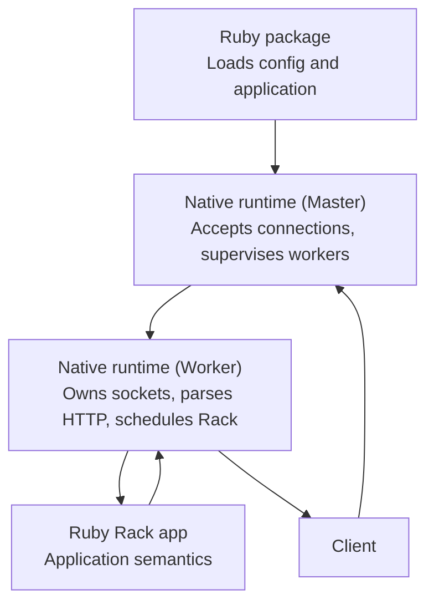

# Architecture

Vajra has one public Ruby package and one native runtime. Ruby owns gem loading, configuration, and application boot. The C++ runtime owns listener sockets, connection dispatch, request parsing, request-body transport, response writing, logging transport, worker lifecycle, and shutdown.

The runtime boundary is:

- Ruby owns application semantics.
- The native runtime owns server behavior.
- Rack is the application boundary.
- The C++ master process accepts sockets and dispatches them to workers.
- Worker processes own dispatched sockets after handoff.
- Worker IO, request parsing, request-body buffering, and response writing run in native code.
- Rack applications run on a fixed Ruby execution pool.
- Request bodies are exposed to Rack through `Vajra::NativeInput`.
- HTTP/2 stream tunnels expose multiplexed byte streams to Rack without transferring the underlying socket.
- Failure handling is explicit at package load, listener bind, request parsing, worker lifecycle, and shutdown boundaries.

## Sections

1. [Request Path](/architecture/request-path/)
2. [Runtime Model](/architecture/runtime-model/)
3. [Native Input](/architecture/native-input/)
4. [Protocols](/architecture/protocols/)
5. [HTTP/2 Stream Tunnels](/architecture/http2-stream-tunnels/)
6. [Rack Hijack](/architecture/rack-hijack/)
7. [Shutdown And Drain](/architecture/shutdown-drain/)
8. [Failure Modes](/architecture/failure-modes/)

## Code Signposts

Use these files when validating architecture claims against implementation:

| Area                  | Source Files                                                                  |
| --------------------- | ----------------------------------------------------------------------------- |
| Runtime supervision   | `gems/vajra/ext/vajra/runtime/native_runtime.cpp`, `worker_pool.hpp`           |
| Runtime configuration | `gems/vajra/lib/vajra.rb`, `gems/vajra/lib/vajra/cli.rb`, `runtime_config.cpp` |
| Request path          | `request_processor.cpp`, `request_head_reader.cpp`, `request_body_reader.cpp`  |
| Response writing      | `response_serializer.cpp`, `response_writer.cpp`                              |
| HTTP/2 session        | `http2_session.cpp`, `http2_stream.cpp`                                        |
| Rack bridge           | `ruby_execution_bridge.cpp`, `ruby_rack_transport.cpp`, `native_input.cpp`     |
| Public types          | `gems/vajra/sig/vajra.rbs`, `gems/vajra/sig/vajra/internal/rack_execution.rbs` |

Core invariants:

- Ruby longjmp-sensitive calls must not run while native mutexes are held.
- HTTP request framing is validated before a Rack request is forwarded.
- HTTP/2 response headers are validated and forbidden connection-specific
  headers are stripped before submission.
- Rack full hijack requires the request body to be fully consumed.
- HTTP/2 stream tunnels keep ownership at the stream level; Vajra continues to
  manage the shared HTTP/2 connection.
