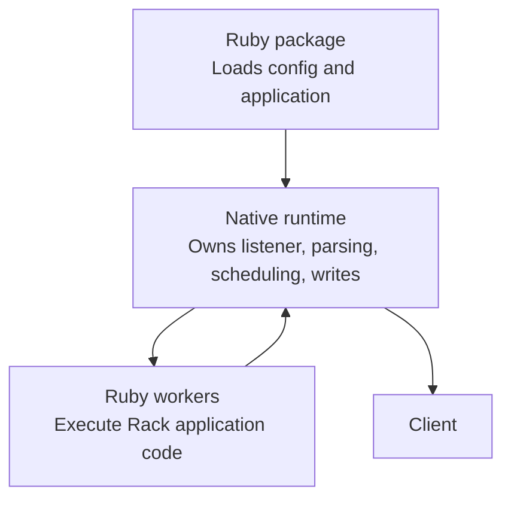

# Architecture

Vajra has one public Ruby package and one native runtime. Ruby owns gem loading,
configuration, and application boot. The C++ runtime owns sockets, request
parsing, worker coordination, response writing, logging transport, and
shutdown.

The split is deliberately simple:

- Ruby owns application semantics.
- Vajra owns server behavior.
- Rack is the application boundary.
- IPC keeps request execution separate from runtime control.
- Failure handling is explicit at package load, listener bind, request parsing,
  worker lifecycle, and shutdown boundaries.

## Sections

1. [Request Path](/architecture/request-path/)
2. [IPC Protocol](/architecture/ipc-protocol/)
3. [Failure Modes](/architecture/failure-modes/)
