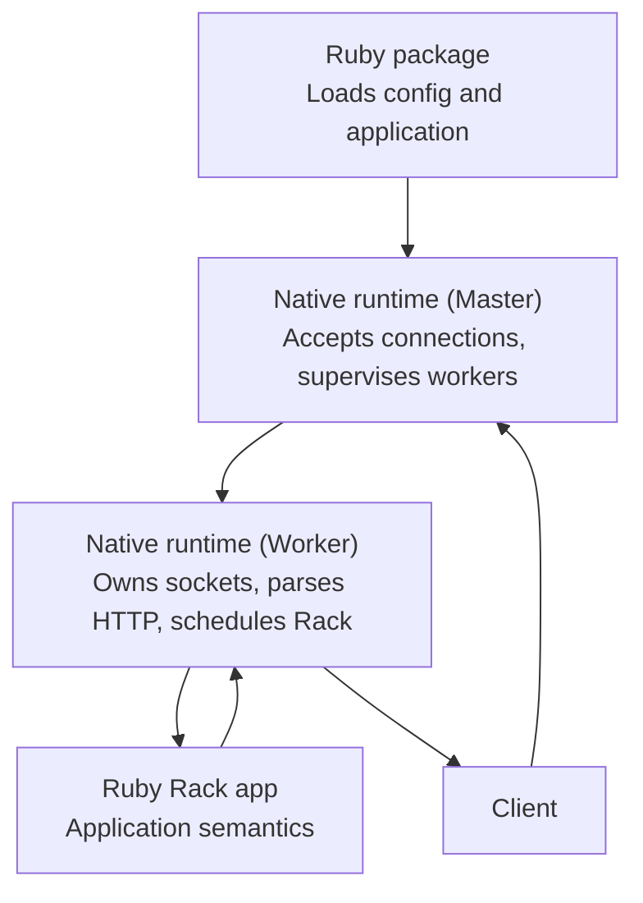

# Architecture

Vajra has one public Ruby package and one shared runtime contract with platform-specific native backends. Ruby owns gem loading, configuration, and application boot. The C++ runtime owns listener sockets, connection dispatch, request parsing, request-body transport, response writing, logging transport, worker lifecycle, and shutdown.

```mermaid
flowchart TD
  ruby["Ruby package<br/>Loads config and application"]
  native["Native runtime (Master)<br/>Accepts connections, supervises workers"]
  workers["Native runtime (Worker)<br/>Owns sockets, parses HTTP, schedules Rack"]
  rack["Ruby Rack app<br/>Application semantics"]
  client["Client"]

  ruby --> native
  native --> workers
  workers --> rack
  rack --> workers
  workers --> client
  client --> native
```

The runtime boundary is:

- Ruby owns application semantics.
- The native runtime owns server behavior.
- Rack is the application boundary.
- The C++ master process accepts sockets and dispatches them to workers.
- Worker processes own dispatched sockets after handoff.
- Worker IO, request parsing, request-body buffering, and response writing run in native code.
- Rack applications run on a fixed Ruby execution pool.
- Request bodies are exposed to Rack through `Vajra::NativeInput`.
- HTTP/2 stream tunnels expose multiplexed byte streams to Rack without transferring the underlying socket.
- Failure handling is explicit at package load, listener bind, request parsing, worker lifecycle, and shutdown boundaries.

The public Rack, protocol, lifecycle, and configuration contracts are shared, but the process and IO mechanisms are not. Linux uses `fork`, Unix control sockets, descriptor passing, shared `mmap`, and `epoll`. macOS uses the same POSIX process and handoff model with `kqueue`. Windows uses Winsock and `WSAPoll`; the master starts workers with `CreateProcessW`, transfers accepted sockets with `WSADuplicateSocketW`, uses framed named pipes for control and supervision, stores shared state in file mappings, and owns workers through a kill-on-close Job Object. Process identities remain distinct from owned process, thread, socket, mapping, and pipe handles.

## Sections

1. [Request Path](/architecture/request-path/)
2. [Runtime Model](/architecture/runtime-model/)
3. [Native Input](/architecture/native-input/)
4. [Protocols](/architecture/protocols/)
5. [HTTP/2 Stream Tunnels](/architecture/http2-stream-tunnels/)
6. [Rack Hijack](/architecture/rack-hijack/)
7. [Shutdown And Drain](/architecture/shutdown-drain/)
8. [Failure Modes](/architecture/failure-modes/)

## Code Signposts

Use these files when validating architecture claims against implementation:

- Runtime supervision: `gems/vajra/ext/vajra/runtime/native_runtime.cpp`, `gems/vajra/ext/vajra/runtime/native_runtime_windows.cpp`, and `gems/vajra/ext/vajra/runtime/windows_worker_backend.cpp`.
- Platform contracts: `gems/vajra/ext/vajra/platform/socket.cpp` and `gems/vajra/ext/vajra/platform/process.cpp`.
- Runtime configuration: `gems/vajra/lib/vajra.rb`, `gems/vajra/lib/vajra/cli.rb`, and `gems/vajra/ext/vajra/runtime/runtime_config.cpp`.
- Request path: `gems/vajra/ext/vajra/request/request_processor.cpp`, `gems/vajra/ext/vajra/request/request_head_reader.cpp`, and `gems/vajra/ext/vajra/request/request_body_reader.cpp`.
- Response writing: `gems/vajra/ext/vajra/response/response_serializer.cpp` and `gems/vajra/ext/vajra/response/response_writer.cpp`.
- HTTP/2 session: `gems/vajra/ext/vajra/request/http2_session.cpp` and `gems/vajra/ext/vajra/rack/http2_stream.cpp`.
- Rack bridge: `gems/vajra/ext/vajra/rack/ruby_execution_bridge.cpp`, `gems/vajra/ext/vajra/rack/ruby_rack_transport.cpp`, and `gems/vajra/ext/vajra/rack/native_input.cpp`.
- Public types: `gems/vajra/sig/vajra.rbs` and `gems/vajra/sig/vajra/internal/rack_execution.rbs`.

Core invariants:

- Ruby longjmp-sensitive calls must not run while native mutexes are held.
- HTTP request framing is validated before a Rack request is forwarded.
- HTTP/2 response headers are validated and forbidden connection-specific headers are stripped before submission.
- Rack full hijack requires the request body to be fully consumed.
- HTTP/2 stream tunnels keep ownership at the stream level; Vajra continues to manage the shared HTTP/2 connection.
