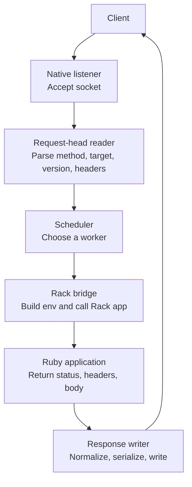

# Request Path

A request moves through Vajra in one server-owned path.

## Ownership

| Stage | Owner | Responsibility |
| --- | --- | --- |
| Listener | Native runtime | Accept connections and own socket lifecycle. |
| Request head | Native runtime | Read and parse the HTTP request head. |
| Scheduling | Native runtime | Apply admission, queueing, and worker selection. |
| Rack bridge | Native runtime and Ruby VM | Build Rack env and call the installed app. |
| Application | Ruby framework/app | Run routing, middleware, controller, or endpoint code. |
| Response | Native runtime | Normalize Rack response and write bytes to the client. |

Access logging is outside the request execution path. When access logging is
enabled, request threads enqueue compact log events and return to serving. A
background logger formats and writes the log lines.
