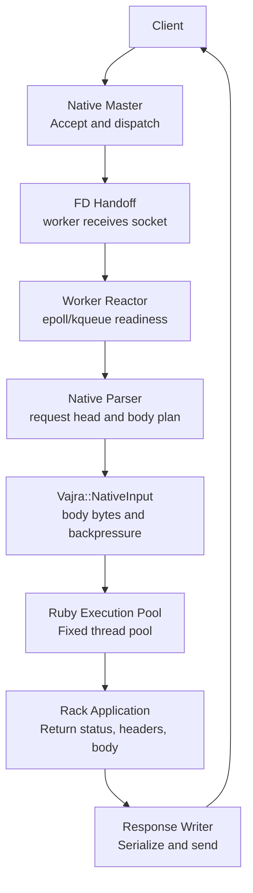

# Request Path

A request moves through Vajra from the master-owned listener to a worker-owned socket, then through native parsing, Rack execution, and native response writing.

## Ownership

| Stage          | Owner                     | Responsibility                                                                              |
| -------------- | ------------------------- | ------------------------------------------------------------------------------------------- |
| Acceptance     | Master process, C++       | Accept TCP connections and choose a worker.                                                 |
| Dispatch       | Master and worker, C++    | Transfer the accepted client file descriptor to the worker.                                 |
| IO readiness   | Worker process, C++       | Register idle sockets with `epoll` or `kqueue`.                                             |
| Request head   | Worker process, C++       | Read and parse the request line and headers within configured limits.                       |
| Request body   | `Vajra::NativeInput`, C++ | Buffer body bytes, spill large rewindable bodies, apply watermarks, and unblock Rack reads. |
| Rack execution | Worker process, Ruby      | Run the Rack app on a fixed execution pool.                                                 |
| Response       | Worker process, C++       | Validate Rack response shape, serialize HTTP framing, and write bytes to the client socket. |

## Body Paths

Requests without a body execute directly. Requests with a body use `Vajra::NativeInput`, including fixed `Content-Length`, chunked HTTP/1.1, and HTTP/2 DATA frames.

Rack code pulls bytes from `rack.input`. Native producers append bytes as they arrive. When the input buffer reaches its high watermark, producers wait for Rack reads to drain capacity. For HTTP/2, consumed-byte accounting releases flow-control credit.

## HTTP/2 Stream Tunnels

Extended CONNECT requests create a Rack environment with
`env["vajra.http2.stream"]`. When the application accepts the stream, Vajra
sends HTTP/2 response headers and switches that request to stream IO. From
there, DATA frames move through the stream object's `read` and `write` methods.

## Keep-Alive

After a response, reusable HTTP/1.x sockets return to the worker reactor. The connection closes when the request asks to close, when the HTTP version defaults to close, when the configured keep-alive request limit is reached, or when runtime shutdown begins.

Access logging is outside the request execution path. When access logging is enabled, request threads enqueue compact log events and return to serving. A background logger formats and writes the log lines.

## Code Signposts

- Listener dispatch and worker ownership: `gems/vajra/ext/vajra/runtime/native_runtime.cpp`.
- HTTP/1 request processing: `gems/vajra/ext/vajra/request/request_processor.cpp`.
- Request-head and request-body parsing: `request_head_reader.cpp` and `request_body_reader.cpp`.
- Rack execution bridge: `gems/vajra/ext/vajra/rack/ruby_rack_transport.cpp`.
- Response serialization and writing: `response_serializer.cpp` and `response_writer.cpp`.
