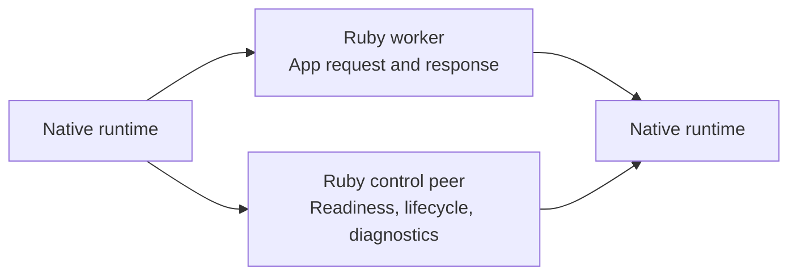

# IPC Protocol

IPC is relevant because Vajra separates request execution from runtime control.
The protocol keeps application request frames separate from lifecycle messages.

## Channels

| Channel | Purpose |
| --- | --- |
| Request channel | Carries request execution input, request body continuation, response metadata, and response body continuation. |
| Control channel | Carries protocol negotiation, process registration, readiness, lifecycle commands, lifecycle state, diagnostics, and reserved telemetry/status. |

## Frame Header

Both channels use a fixed-width binary frame header.

| Bytes | Meaning |
| --- | --- |
| `0` | channel kind |
| `1` | reserved byte |
| `2..3` | frame-family wire id |
| `4..5` | protocol major version |
| `6..7` | protocol minor version |
| `8..11` | payload length |

The protocol fails closed:

- unknown channel values are rejected
- unknown frame families are rejected
- request/control family mismatches are rejected
- non-zero reserved bits are rejected
- unsupported protocol versions are rejected before request execution

Request frames move application data. Control frames move lifecycle state. A
frame family has one responsibility; mixed-purpose frames are not part of the
protocol.
