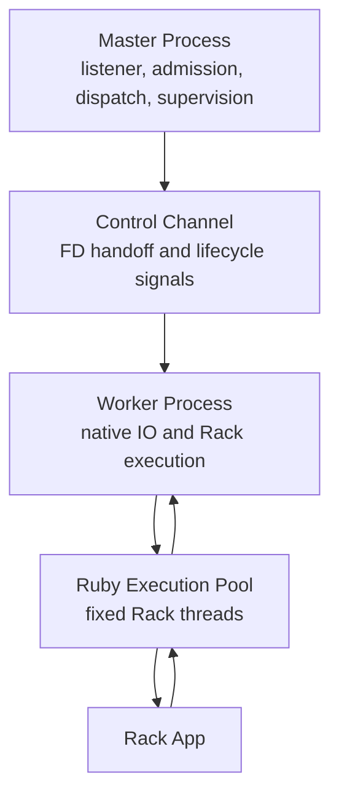

# Runtime Model

Vajra keeps listener control in the master process. The master accepts connections, supervises workers, tracks health, and dispatches accepted file descriptors to workers. Workers own sockets after handoff and run request IO, protocol parsing, request-body transport, Rack execution scheduling, and response writing.

## Master Responsibilities

- bind and own the listener socket
- admit accepted connections
- dispatch accepted sockets to workers
- supervise worker lifecycle and health
- coordinate drain, shutdown, and replacement behavior
- expose aggregate runtime state through configured control-plane endpoints

## Worker Responsibilities

- receive dispatched client sockets
- register idle sockets with the native reactor
- parse HTTP request heads
- stream request bodies into `Vajra::NativeInput`
- schedule Rack execution on the fixed Ruby execution pool
- serialize and write responses
- report progress, health, and counters back to runtime state

The master process, not kernel listener balancing, selects workers and manages
worker lifecycle.

## Ruby Thread Boundary

Ruby threads execute Rack application code. Native worker IO threads do not run application code. They read sockets, parse protocol state, feed native request input, and wake Rack execution when work is ready.

This boundary keeps blocking socket IO outside the Ruby GVL while preserving the standard Rack application contract.

## Code Signposts

- Worker lifecycle and descriptor handoff: `gems/vajra/ext/vajra/runtime/native_runtime.cpp`.
- Shared worker state: `gems/vajra/ext/vajra/runtime/worker_pool.hpp`.
- Runtime stats and metrics: `gems/vajra/ext/vajra/runtime/runtime_state.cpp`.
- Ruby execution pool: `gems/vajra/ext/vajra/rack/ruby_rack_transport.cpp`.
