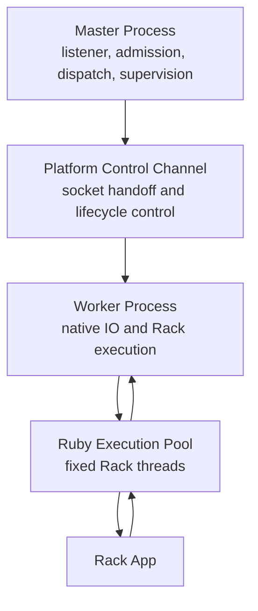

# Runtime Model

Vajra keeps listener control in the master process. The master accepts connections, supervises workers, tracks health, and dispatches accepted sockets to workers. Workers own sockets after handoff and run request IO, protocol parsing, request-body transport, Rack execution scheduling, and response writing.

```mermaid
flowchart TD
  master["Master Process<br/>listener, admission, dispatch, supervision"]
  control["Platform Control Channel<br/>socket handoff and lifecycle control"]
  worker["Worker Process<br/>native IO and Rack execution"]
  pool["Ruby Execution Pool<br/>fixed Rack threads"]
  app["Rack App"]

  master --> control
  control --> worker
  worker --> pool
  pool --> app
  app --> pool
  pool --> worker
```

## Master Responsibilities

- bind and own the listener socket
- admit accepted connections
- dispatch accepted sockets to workers
- supervise worker lifecycle and health
- coordinate drain, shutdown, and replacement behavior
- expose aggregate runtime state through configured control-plane endpoints

## Worker Responsibilities

- receive dispatched client sockets
- register idle sockets with the native reactor
- parse HTTP request heads
- stream request bodies into `Vajra::NativeInput`
- schedule Rack execution on the fixed Ruby execution pool
- serialize and write responses
- report progress, health, and counters back to runtime state

The master process, not kernel listener balancing, selects workers and manages worker lifecycle.

## Platform Runtime Backends

| Responsibility        | Linux                                           | macOS                                           | Windows                                                                                              |
| --------------------- | ----------------------------------------------- | ----------------------------------------------- | ---------------------------------------------------------------------------------------------------- |
| Worker creation       | `fork` from the preloaded master                | `fork` from the preloaded master                | `CreateProcessW` with serialized runtime configuration and an inherited-handle allowlist             |
| Control channel       | Unix socket                                     | Unix socket                                     | Message-mode named pipe with versioned frames                                                        |
| Socket transfer       | `SCM_RIGHTS` descriptor passing                 | `SCM_RIGHTS` descriptor passing                 | `WSADuplicateSocketW` metadata and worker-side `WSASocketW` reconstruction                           |
| Connection readiness  | `epoll`                                         | `kqueue`                                        | `WSAPoll`                                                                                            |
| Shared runtime state  | Anonymous shared `mmap` inherited across `fork` | Anonymous shared `mmap` inherited across `fork` | File mapping handle inherited by workers                                                             |
| Parent ownership      | Process IDs and signal-driven supervision       | Process IDs and signal-driven supervision       | Owned process handles grouped in a kill-on-close Job Object                                          |
| Shutdown notification | `SIGINT`/`SIGTERM` and runtime control messages | `SIGINT`/`SIGTERM` and runtime control messages | Console control events or `Vajra.stop`, control frames, and an inherited manual-reset shutdown event |

The platform backends preserve the same ownership contract: the master owns admission and supervision, workers own dispatched client sockets, and shared runtime state is the source for aggregate worker health and counters.

## Ruby Thread Boundary

Ruby threads execute Rack application code. Native worker IO threads do not run application code. They read sockets, parse protocol state, feed native request input, and wake Rack execution when work is ready.

This boundary keeps native socket waits outside the Ruby GVL while preserving the standard Rack application contract. Rack execution and blocking Ruby-facing native input or tunnel calls use explicit GVL boundaries rather than assuming that every operation is GVL-free.

## Code Signposts

- POSIX worker lifecycle and descriptor handoff: `gems/vajra/ext/vajra/runtime/native_runtime.cpp`.
- Windows worker lifecycle, named-pipe protocol, socket duplication, replacement, and Job Object ownership: `gems/vajra/ext/vajra/runtime/windows_worker_backend.cpp`.
- Windows runtime selection and Ruby lifecycle boundary: `gems/vajra/ext/vajra/runtime/native_runtime_windows.cpp`.
- Shared worker state: `gems/vajra/ext/vajra/runtime/worker_pool.hpp`.
- Runtime stats and metrics: `gems/vajra/ext/vajra/runtime/runtime_state.cpp`.
- Ruby execution pool: `gems/vajra/ext/vajra/rack/ruby_rack_transport.cpp`.
