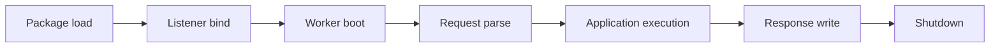

# Failure Modes

Vajra prefers explicit failure over hidden fallback. Each major failure class
belongs to a visible runtime boundary.

## Boundaries

| Failure | Runtime Behavior |
| --- | --- |
| Native extension missing or stale | Package load fails with an actionable error. |
| Listener bind failure | Startup fails before serving requests. |
| Worker boot failure | Startup reports worker readiness failure. |
| Malformed request head | Parser rejects the request with bounded behavior. |
| Oversized request head | Parser rejects the request at the configured limit. |
| Worker exit while serving | Runtime reports worker failure and follows replacement or shutdown behavior. |
| Shutdown while serving | Listener drains, request channel closes, workers exit, and sockets are released. |

## What To Inspect

- package load errors for native extension problems
- startup logs for bind and worker boot failures
- lifecycle logs for worker replacement, drain, and shutdown
- stats endpoint output when `stats_path` is configured
- HTTP response behavior for parser and request-limit failures
