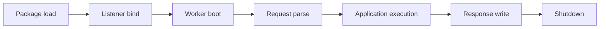

# Failure Modes

Vajra reports failures at explicit runtime boundaries without hidden fallback
behavior.

## Boundaries

| Failure                           | Runtime Behavior                                                                                             |
| --------------------------------- | ------------------------------------------------------------------------------------------------------------ |
| Native extension missing or stale | Package load fails with an actionable error.                                                                 |
| Listener bind failure             | Startup fails before serving requests.                                                                       |
| Worker boot failure               | Startup reports worker readiness failure.                                                                    |
| Malformed request head            | Parser rejects the request with bounded behavior.                                                            |
| Oversized request head            | Parser rejects the request at the configured limit.                                                          |
| Slow client upload                | Native input watermarks limit buffered body bytes and force producers to wait for capacity.                  |
| Oversized request body            | Native input fails the body, unblocks Rack readers, and preserves the configured error response behavior.    |
| Worker exit while serving         | Runtime reports worker failure and follows replacement or shutdown behavior.                                 |
| Shutdown while serving            | Listener admission stops, workers drain active Rack execution within `worker_timeout`, idle sockets close, and runtime resources are released. |

## What To Inspect

- package load errors for native extension problems
- startup logs for bind and worker boot failures
- lifecycle logs for worker replacement, drain, and shutdown
- stats endpoint output when `stats_path` is configured
- HTTP response behavior for parser and request-limit failures

## Code Signposts

- Worker lifecycle events and recovery state: `gems/vajra/ext/vajra/runtime/native_runtime.cpp`.
- Runtime log and lifecycle telemetry emission: `gems/vajra/ext/vajra/runtime/runtime_logging.cpp`.
- Stats and metrics state: `gems/vajra/ext/vajra/runtime/runtime_state.cpp`.
- Request rejection paths: `gems/vajra/ext/vajra/request/request_processor.cpp` and `http2_session.cpp`.
