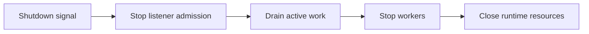

# Shutdown And Drain

Vajra shutdown is coordinated from the native runtime. The master stops accepting new work, signals workers, drains active Rack execution up to the configured worker runtime limit, and releases sockets.

## Drain Boundary

Drain starts by preventing new accepted connections from entering the request
path. Active Rack application calls have until `worker_timeout` to complete.
Idle keep-alive sockets and incomplete next requests close during drain.

## Worker Stop

Workers receive shutdown state through runtime control channels and native runtime state. Each worker stops queueing new connection work, waits for the same-process Rack execution pool to become idle within `worker_timeout`, then exits. If active Rack execution does not drain in that window, worker shutdown falls back to the runtime termination path.

## Hijacked Sockets

Hijacked sockets are Ruby-owned after a successful full hijack. Vajra excludes them from keep-alive reuse and native timeout management. Ruby code is responsible for closing the returned `IO`.

## HTTP/2 Stream Tunnels

Accepted HTTP/2 stream tunnels are stream-owned, not socket-owned. During
process shutdown, Vajra resets remaining HTTP/2 streams so shutdown is not held
open by tunnel traffic. Applications should close or reset accepted streams as
part of their own shutdown path.

## Log Rotation

`SIGUSR1` reopens configured access and error log files. Use it after external log rotation so workers write to the replacement files.

## Code Signposts

- Shutdown coordination and worker drain: `gems/vajra/ext/vajra/runtime/native_runtime.cpp`.
- Rack execution idle wait: `gems/vajra/ext/vajra/rack/ruby_rack_transport.cpp`.
- Log reopen handling: `gems/vajra/ext/vajra/runtime/runtime_logging.cpp`.
